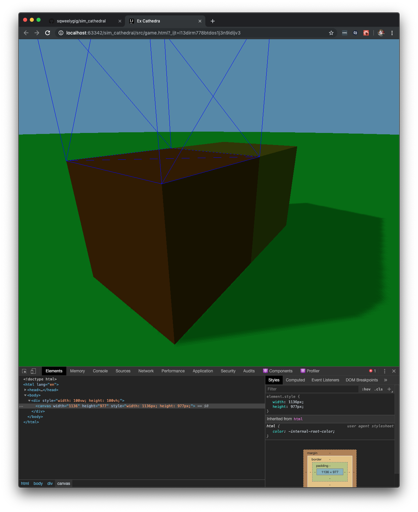

SimCathedral
==

A browser based management sim game based around the changing fates of a place of worship.

The current choice is for the English Christian Church from late Saxon to current day, with an eye kept towards enabling other stories.  It has experienced a decent amount of change and I've a modest background knowledge.

The purpose of this project is the intersection of:
 * Personal interest in the gamification and education sectors
 * Displays and maintains my skills across the web development stack

Thoughts
--
* TypeScript, node.js, React, REST and SQL are all good technologies, and I've experience.
* Walking and paths are almost always buggy, and rarely valuable.  Walkability and travel times are sometimes important, actually walking is not.
* The idea of air-side & ground-side from Airport CEO adds some very interesting aspects to a sim.  Areas, and boundaries between areas, are great.
* The novelty of a theme is often very important. It should be different, but not too different. (ie do not do airport, hospital, village or theme park)
* The comedy present in the hospital games feels like part of their USP, and not something that absolutely must be replicated.
* Currency (whether gold, doubloons, or megabucks) is a really simple resource system, but is off-theme and boring (it being just one number that slides).
* What about a "use & cooldown" resource system where parishioners have skills they may lend to a project, but only one at a time. A bit like employees in Two-Point Hospital.
* Monks should be super-powered because they are always available, but also super-expensive because the cathedral needs to maintain them.
* The game-engine could keep ticking even when unattended (think FarmVille) and play across several weeks.

DevDiary
--

### 2019-08-?? sqweelygig
I really like CEO games.  Could I make a game, either tile/board or browser, that would capture some of that?  Have mooched around several ideas, played several games and found some thoughts.  I also watched a lot of Time Team and realised that the cathedral, with monasteries, saints, parishes and reformations is both fascinating and enclosed.

### 2019-09-?? sqweelygig & chaos_fairy
Had many discussions around currency, gold, and its necessity.  Formed "Currency" thought.  Also realised educational notes to the theme, and realised that this would fit superbly with a slow-play game.

### 2019-10-08 sqweelygig
Have created a basic render that shows a set of blocks from a hard-coded array and calculates a cursor point based on mouse location.  Its not much, but it is a start.  I am performing a few housekeeping tasks and pushing to github, partly because I'm a few days into the project and partly because it a very pertinent portfolio piece for a job application I am making.

